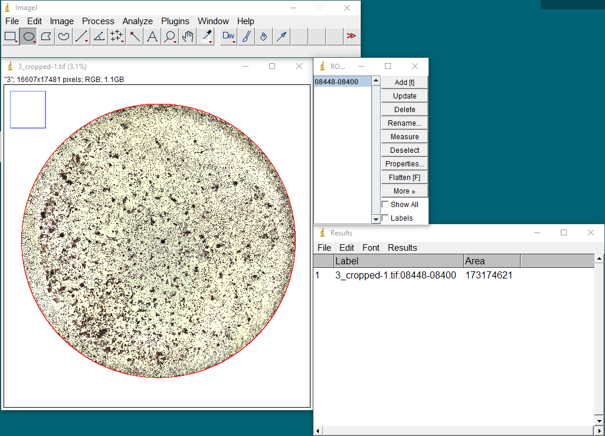

# NOISe: Nuclei-Aware Osteoclast Instance Segmentation for Mouse-to-Human Domain Transfer
<div align="center">
  <p>
    
  </p>
</div>

NOISe builds on top of [YOLOv8](https://github.com/ultralytics/ultralytics) for the task of osteoclast instance segmentation. This repository contains training, validation, and inference scripts to train an instance segmentation model from scratch and finetune on top of the provided checkpoints trained for osteoclast and nuclei detection as proposed in our [paper](https://arxiv.org/pdf/2404.10130.pdf):

Manne, S.K.R., Martin, B., Roy, T., Neilson, R., Peters, R., Chillara, M., Lary, C.W., Motyl, K.J., Wan, M., "NOISe: Nuclei-Aware Osteoclast Instance Segmentation for Mouse-to-Human Domain Transfer.” IEEE/CVF Conference on Computer Vision and Pattern Recognition 2024 (CVPR 2024), Workshop on Computer Vision for Microscopy Image Analysis (CVMI).

<details open>
<summary>Install</summary>

Pip install the ultralytics package including all [requirements](https://github.com/ultralytics/ultralytics/blob/main/pyproject.toml) in a [**Python>=3.8**](https://www.python.org/) environment with [**PyTorch>=1.8**](https://pytorch.org/get-started/locally/).

Below verified setup uses Pytorch 2.3 with CUDA 12.1 support:
```bash
conda create --name noise python=3.8
conda activate noise
conda install pytorch torchvision torchaudio pytorch-cuda=12.1 -c pytorch -c nvidia
pip install ultralytics scikit-spatial
```

For alternative installation methods including [Conda](https://anaconda.org/conda-forge/ultralytics), [Docker](https://hub.docker.com/r/ultralytics/ultralytics), and Git, please refer to the [Quickstart Guide](https://docs.ultralytics.com/quickstart).

</details>

## Quickstart Guide: Whole Slide Inference 
This section will walk you through applying one of our osteoclast instange segmentation models on your own whole slide or well images, without needing to do any machine learning training, and with minimal setup and computing requirements. Internally, our script will break your image down into overlapping ```832x832``` resolution patches, apply the specific instance segmentation model on those patches, and then intelligently merge the results to generate results for your original image. 

You do need to download the model "checkpoint" corresponding to the model you want to run, and place it in a `/checkpoint` directory. You can follow our recommendations below for which model to use, or take a look at our [paper](https://arxiv.org/pdf/2404.10130.pdf) for more information about each model.

| Experiment | Model Filename | Description | Use This Model For ... |
| ----- | ----- | ----- | ----- |
| YOLOv8 M→M | `yolo_m1234.pt` | YOLOv8 model trained on M1, M2, M3, M4 | **Mouse osteoclast** instance segmentation (use this, or any of the other four YOLOv8 M→M models below) |
| YOLOv8 M→M | `yolo_m1235.pt` | YOLOv8 model trained on M1, M2, M3, M5 | |
| YOLOv8 M→M | `yolo_m1245.pt` | YOLOv8 model trained on M1, M2, M4, M5 | |
| YOLOv8 M→M | `yolo_m1345.pt` | YOLOv8 model trained on M1, M3, M4, M5 | |
| YOLOv8 M→M | `yolo_m2345.pt` | YOLOv8 model trained on M2, M3, M4, M5 | | 
| NOISe M→H and H→H | `yolo_m_det_only.pt` | YOLOv8 model trained on mouse osteoclast & nuclei bounding boxes for detection only, used as multiclass pretraining step in the NOISe models  | **Developing a NOISe model** in a new domain (by fine-tuning this on instance segmentation masks in that domain) |
| NOISe M→H | `noise_m.pt` | NOISe model trained on M1–5 (i.e., `yolo_m_det_only.pt`, fine-tuned on M1–5 instance segmentation masks) | **Mouse, human, or new domain osteoclast** instance segmentation (try this alongside the other recommended models) |
| NOISe H→H | `noise_m_h1.pt` | NOISe model trained on H1 (i.e., `yolo_m_det_only.pt`, fine-tuned on H1 instance segmentation masks) | **Human osteoclast** instance segmentation (use this, or the NOISe H→H model below)  |
| NOISe H→H | `noise_m_h1.pt` | NOISe model trained on H2 (i.e., `yolo_m_det_only.pt`, fine-tuned on H2 instance segmentation masks) |

Inference can be performed with the following command.

```
python wholeslide_inference.py --model_path path/to/checkpoint.pt --img_foldername path/to/images --out_foldername path/to/output --total_well_area_in_pixels integer
```

You can include ```--ratio r``` to set the μm/pixel ratio ```r``` for your dataset. The default value is the ratio for our training images, 0.7784 μm/pixel. We use this to scale the pixel size of the underlying square patches in which inference is performed, which are 832 × 832 by default, so that the side length always corresponds to the true length of ~647.7 μm = 832 pixels × 0.7784 μm/pixel. 

Our patches were chosen in order to dwarf the size of most osteoclasts in our training data, but detection can struggle when there are large osteoclasts with sizes comparable to our patch size of ~647.7 μm. We found that artificially reducing ```r``` can serve as a quick workaround: for instance, setting ```r``` to half of its true value (0.3892 μm/pixel, for us), tricks the algorithm into thinking that the osteoclasts are only half of their actual size, so more of them can fit into the patches. This is not an ideal solution by any means, since the underlying data (osteoclast incidence and appearance) is not really scale invariant, but it seems to work reasonably well for ~2× adjustments.

You can select a CUDA device, e.g. with ```--device cuda```, but otherwise inference will run on a cpu by default.

You can include ```--total_well_area_in_pixels``` for accurate percent osteoclast coverage of each well. The method to find the total well area in pixels for this argument is shown below. If output is not needed, the default will return None for this calculation. 

Outputs will be stored in ```path/to/output```. The output for each image consists of a text file containing all predicted bounding boxes, objectness scores, and segmentation masks as well as an image representing these same results.

## Determining the Total Area of the Well in Pixels for Area Output

ImageJ is used following the steps below to determine the area value for the argument ```--total_well_area_in_pixels```. 

1) Open an image from your dataset in ImageJ.
2) Use the circle tool to fit the circle to the perimeter of the well, and add to the ROI manager.
3) Hit measure to obtain an area in pixels, this integer will be used for the ```--total_well_area_in_pixels``` argument. In the example below, the area ```173174621``` would be utilized as the value for this argument.

<div align="center">
  <p>
    
  </p>
</div>

## Calculating an Accurate um/pixel Ratio

The um/pixel ```--ratio``` can be estimated in ImageJ using the following steps.

1) Determine the surface area of your well in um, this info can be found on the manufacturer's website for the cell culture plate you are using.
2) Find the total area of the well in pixels (shown in the above step).
3) Use the line tool in ImageJ (shown in image below) to measure the diameter of the well. Divide this value by 2 to obtain the radius of the well.
4) Now use the formula (well surface area)/(radius) = ratio to obtain the estimated ratio of um/pixels


## Dataset
Our dataset consists of full slide images and corresponding instance segmentation annotations, along with patches used for training and validation in our experiments. Please download the dataset from [here](https://drive.google.com/drive/folders/1hwGVKH4pN1Ftcl9bDKUykTIU8mcZfmiu?usp=drive_link), unzip the data and place it in the dataset folder with the following folder structure:

```
noise
    |...
    |-- dataset
        |-- m1
            |-- images
            |-- labels
        |-- m2
            |-- images
            |-- labels
        |...
        |-- m5
            |-- images
            |-- labels
    |...
```

Update the dataset folder absolute path in ```osteo.yaml``` accordingly.

## Training
Training from scratch or finetuning a specific checkpoint can be done using the following command:

```
python train.py --ckpt path/to/checkpoint.pt
```

Sample command to train a YOLOv8 M→H model:
```
python train.py --ckpt checkpoints/yolo_m_det_only.pt --data ./osteo.yaml --name YOLOv8MH
```

## Validation
Running evaluation on test data can be done using the following command:

```
python val.py --ckpt path/to/checkpoint.pt
```

Sample command to validate a YOLOv8 M→M model:
```
python train.py --ckpt checkpoints/yolo_m2345.pt --data ./osteo.yaml
```

## Training on your data
NOISe can be further improved by training on custom data following these steps:

### Preparing dataset
We provide a helper script to convert whole slide images into overlapping patches of a fixed size for training and validation of models.

```
python create_patches.py --img_foldername path/to/wsi_imagefolder --roi_foldername path/to/imageJ_rois --out_foldername path/to/patch_folder
```

### Configs
Update the config.yaml according to the dataset created:
```
path: path/to/patch_data
train: [train_folder1, train_folder2, ...]
val: [test_folder1, test_folder2, ...]
```

### Train
Once the dataset is generated, and the `config.yaml` file is adjusted accordingly, training can be done using:

```
python train.py --ckpt path/to/checkpoint.pt --data config.yaml
```

## Acknowledgement
NOISe is largely based on [YOLOv8](https://github.com/ultralytics/ultralytics).

## Citation
If you find the dataset, model weights, or the code useful for your work, please consider citing us:
```
@InProceedings{ManneMartin_2023_CVPR,
    author    = {Manne, S.K.R. and Martin, B. and Roy, T. and Neilson, R. and Peters, R. and Chillara, M. and Lary, C.W. and Motyl, K.J. and Wan, M.},
    title     = {NOISe: Nuclei-Aware Osteoclast Instance Segmentation for Mouse-to-Human Domain Transfer},
    booktitle = {Proceedings of the IEEE/CVF Conference on Computer Vision and Pattern Recognition (CVPR) Workshops},
    month     = {June},
    year      = {2024}
}
```
Note that the first two authors contributed equally.
